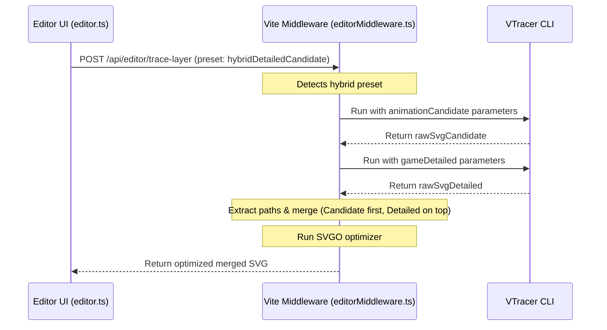

# Design Spec: Hybrid Trace Preset (Detailed + Animation)

This design document outlines the implementation plan for introducing a new hybrid tracing preset that combines `animationCandidate` and `gameDetailed` presets into a single layer output.

## Goal

Create a new preset option **Hybrid (Detailed + Animation)** (`hybridDetailedCandidate`). When tracing a layer with this preset:
1. The image mask is traced using the `animationCandidate` preset first (smoother shapes, fewer points, acts as the base layer).
2. The image mask is traced using the `gameDetailed` preset second (detailed, higher color precision, acts as the detail layer).
3. The paths from both results are merged into a single SVG (Candidate paths first, Detailed paths on top).
4. The merged SVG is optimized using SVGO and returned to the client.

## User Review / Behavior

- **UI Presets Dropdown**: Adds a new `<option value="hybridDetailedCandidate">` in `crop-editor.html`.
- **Parameter Sliders**: Disables parameter sliders and values on the UI when `hybridDetailedCandidate` is active, as it executes a hardcoded dual-run logic on the server.
- **Trace Output**: Output SVG will contain layers combined in z-order: `animationCandidate` below, `gameDetailed` on top.

## Architecture & Data Flow

## Proposed Changes

### UI & Client Logic

#### [crop-editor.html](file:///d:/soflware/Unity/Source/Farm_HTML/crop-editor.html)
- Add the `<option>` tag to `preset-select`.

#### [src/editor.ts](file:///d:/soflware/Unity/Source/Farm_HTML/src/editor.ts)
- Update `vtracerPresets` mapping to include `hybridDetailedCandidate: { isHybrid: 1 }`.
- In `applyPreset()`, if the preset is `hybridDetailedCandidate`, disable the parameters sliders and update their text.
- In `setupUIEventListeners()`, re-enable sliders if switching away from the hybrid preset.
- Include `preset` in the POST payload for `/api/editor/trace-layer`.

### Backend API Middleware

#### [scripts/vite-plugins/editorMiddleware.ts](file:///d:/soflware/Unity/Source/Farm_HTML/scripts/vite-plugins/editorMiddleware.ts)
- Update `TraceLayerPayload` to include `preset?: string`.
- Update `handleTraceLayerRequest()`:
  - If `preset === "hybridDetailedCandidate"`, run VTracer CLI twice on the same temporary input file using preset configurations.
  - Parse/extract `<path>` segments from both SVG strings.
  - Assemble them: `<svg header> + <candidate paths> + <detailed paths> + </svg>`.
  - Optimize the composite XML using `svgo`'s `optimize()`.
  - Return the final trace result.

## Verification

- **Manual Verification**: Launch the development server using `run_dev.ps1`, open `http://localhost:4000/crop-editor.html`, select the Hybrid preset, draw a lasso mask, trace, and inspect the resulting paths and SVG preview.
